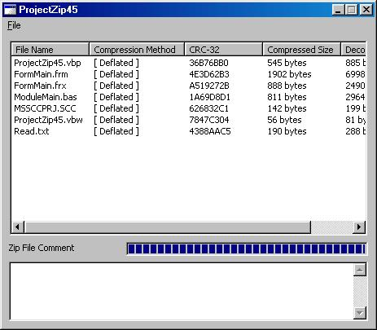



## ProjectZip45

### Description

This sample provides a look into the structure of Zip Files.

It will allow you a look at some the information stored in them, and

later I will be updating it with decompression algorithms and

extraction routines.

Take a look, learn something, and have fun !!
 
### More Info
 

             |
---                |---
**Submitted On**   |2003-09-29 11:27:06
**By**             |[Jason A Cole](https://github.com/Planet-Source-Code/PSCIndex/blob/master/ByAuthor/jason-a-cole.md)
**Level**          |Intermediate
**User Rating**    |4.7 (33 globes from 7 users)
**Compatibility**  |VB 5\.0, VB 6\.0
**Category**       |[Files/ File Controls/ Input/ Output](https://github.com/Planet-Source-Code/PSCIndex/blob/master/ByCategory/files-file-controls-input-output__1-3.md)
**World**          |[Visual Basic](https://github.com/Planet-Source-Code/PSCIndex/blob/master/ByWorld/visual-basic.md)
**Archive File**   |[ProjectZip1651799292003\.zip](https://github.com/Planet-Source-Code/jason-a-cole-projectzip45__1-48880/archive/master.zip)

